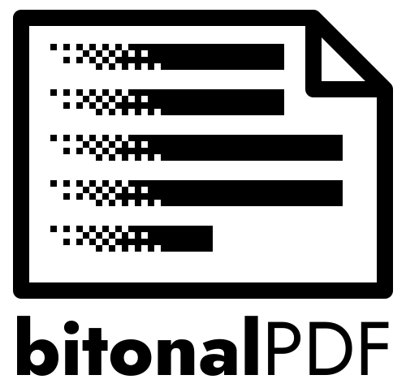

<p align="center"></p>

# bitonalPDF

Shrink scanned PDFs on macOS without hurting the text. A 59 MB, 166-page book scan became 9 MB and
stayed fully readable. Preview's Quartz filters and Compressor often make such files *bigger*; this
never does (if the result isn't smaller, no file is written).

Each page is rasterised, its background is flattened (so shadows from microfilm or book spines don't
break the threshold), and it is stored as a 1-bit Group4 image. There is also a colour mode for books
with pictures.

| Mode | For | How | Typical result |
|---|---|---|---|
| `text` (default) | pure text scans: typewriter, print | 300 dpi, 1-bit Group4 | 55–85% smaller in tests |
| `images` | books with pictures/diagrams | 150 dpi colour JPEG | varies; skipped if not smaller |

`text` drops colour and greytones on purpose — don't use it on books with figures.
Both modes turn pages into images, which is fine for scans (they have no text layer to lose) but not
for born-digital PDFs.

## Install

macOS only. Needs [Homebrew](https://brew.sh) packages:

```bash
brew install poppler imagemagick
brew install tesseract         # optional, only needed for --rotate
git clone https://github.com/FasterMadman/bitonalPDF && cd bitonalPDF
./build.sh            # builds bitonalPDF.app; drag it to ~/Applications
```

The app is not notarised, so macOS asks for confirmation the first time (right-click → Open).

## Use

**Droplet:** drop one or more PDFs on `bitonalPDF.app`, choose *Pure text* or *With pictures*, tick any
preprocessing you want, follow the progress bar in the Dock. The result lands next to the original as
`<name>.1bit.pdf` or `<name>.shrunk.pdf`. The original is never touched.

**Terminal:**

```bash
./bitonalpdf.sh scan.pdf                    # text mode
MODE=images ./bitonalpdf.sh book.pdf        # colour mode
./bitonalpdf.sh scan.pdf out.pdf 65         # bolder text (threshold %, default 60)
```

### Preprocessing (rotate, crop, split, deskew)

Scans that are rotated 90°, contain two book pages per PDF page, or are skewed give bad results
downstream (OCR, text extraction). These are opt-in flags, applied per page in this order —
**rotate → crop → split → deskew** — before the threshold step above:

```bash
./bitonalpdf.sh --rotate --crop --split auto --deskew reading-list.pdf
```

| Flag | What it does |
|---|---|
| `--rotate` | Detects pages lying on their side or upside down (Tesseract OSD) and rotates them upright. Needs `tesseract`; skipped with a warning if it's not installed, or if a page has too little text to read its orientation. |
| `--crop` | Trims scanner/microfilm borders. Trims each page to its text block (dark scanner borders are ignored), then centres every page on a canvas the size of the largest text block, so all pages come out the same size. |
| `--split auto\|off\|N%` | Cuts two-page spreads into separate pages. `auto` detects double pages and the gutter (spine) position per page, using the document-wide median as a fallback for pages it isn't sure about. `N%` (e.g. `--split 52%`) skips detection and forces the gutter at that position on every double-shaped page — use it when `auto` gets a document wrong. Default `off`. |
| `--deskew` | Straightens each resulting page (small-angle rotation), after splitting. |

Double-page detection is a best-effort heuristic (aspect ratio + a column-brightness profile of the
page, looking for the gap between the two text blocks). It's deliberately conservative: a normal
page or a wide table/figure is never cut in half, and a page that *looks* like a double page but
where no gutter can be found with confidence is **left unsplit and flagged** rather than guessed —
the script exits with status 2 and lists the page numbers on stderr (the PDF is still written; check
those pages by hand, or re-run with `--split N%`).

Verify the output on your own scans before trusting this on a large batch — the thresholds it uses
are tuned on synthetic test pages, not a corpus of real scans.

### Not implemented

Adding a hidden OCR text layer (`--ocr`, e.g. via `ocrmypdf`) so the output PDF itself is searchable
is intentionally left out for now — it doesn't help a markdown-extraction pipeline (which reads the
PDF directly, not any embedded text layer) and only matters for reading the PDF in a viewer.

## Known limits

- Preprocessing accuracy depends on real scans varying a lot; treat `--split auto` results as a
  starting point and spot-check the output, especially on unusual layouts (multi-column articles,
  facing blank pages).
- The threshold is fixed at 60 in the droplet; use the terminal to change it.

## License

[AGPL-3.0](LICENSE). `poppler` and `imagemagick` are run as separate programs, not linked.

## App icon

macOS 26 puts legacy `.icns` icons in a grey plate. The icon is therefore an Icon Composer document
(`assets/AppIcon.icon`) compiled to `assets/compiled/Assets.car`. The compile needs Xcode's `actool`, so
it runs in the manual **compile-icon** GitHub workflow (Actions → compile-icon → Run workflow); download
the artifact into `assets/compiled/` and run `./build.sh`.
